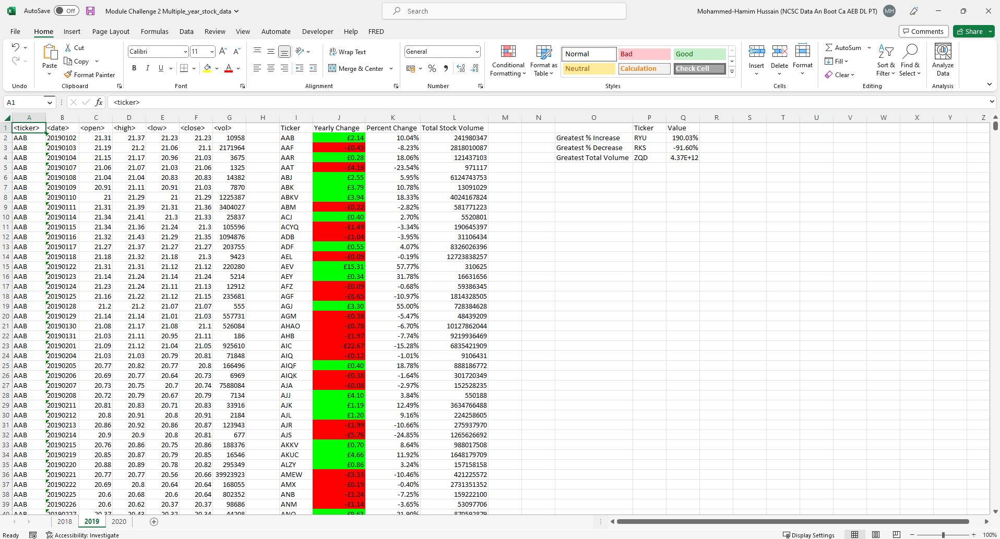
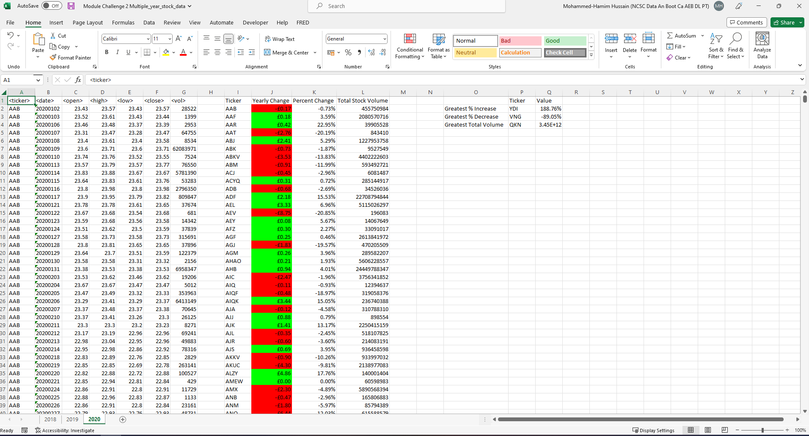

# Exploring Financial Data Analysis through VBA Scripting: Unveiling Stock Market Insights

## Introduction
This project involves delving into dynamically generated stock market data to extract insights. I have crafted a script that computes yearly changes, percentage variations, and cumulative stock volumes, while also identifying stocks with the most substantial percentage fluctuations and trading volumes. As I progressed, I adapted my VBA script for concurrent execution across multiple worksheets, magnifying the impact of automation. The result? Uncovering invaluable financial insights and revolutionising my approach to data manipulation and interpretation.

## Source of Data
Within Resources Folder:
* Multiple_year_stock_data.xlsx

## Findings

The table represent a collection of stock data for various tickers (stock symbols) over the course of the years 2018, 2019 and 2020. The data includes the opening, high, low, and closing prices for each ticker on specific dates, along with the corresponding trading volume. Yearly changes and percentage changes for each ticker have been calculated, showing how the closing price differs from the opening price at the beginning of the year. The table identifies the stock with the greatest percentage increase, greatest percentage decrease, and greatest total volume among the listed tickers.

### 2018

1. **Ticker 'THB' experienced a 141.42% increase in its stock value**: This means that over the course of the year 2018, the closing price of the 'THB' stock increased by approximately 141.42% compared to its opening price at the beginning of the year. Such a remarkable increase could indicate positive market sentiment, strong company performance, strong financial results, market trends, or favorable news that contributed to this growth. 
2. **Ticker 'RKS' faced a significant 90.02% decrease in its stock value**: In contrast, this finding indicates that the closing price of the 'RKS' stock declined by approximately 90.02% during the year compared to its opening price. A decrease of this magnitude suggests that the stock encountered significant challenges or negative market sentiment throughout the year, which might have been influenced by factors like poor financial performance, industry trends, or unfavorable news. This level of decline could indicate substantial risk, and careful research is required to determine if there are potential recovery prospects or if the company's situation is too precarious for investment.
3. **Ticker 'QKN' had the highest total stock volume, amounting to 1.68954E+12**: Total stock volume refers to the total number of shares traded for a particular stock throughout the year. A higher trading volume suggests a high level of market activity and interest in that stock. The extremely high total stock volume for 'QKN' could signify significant investor attention and liquidity in the market for this stock.
   
### 2019

1. **Ticker 'RYU' experienced a substantial 190.03% increase in its stock value**: This means that over the course of the year 2019, the closing price of the 'RYU' stock increased by approximately 190.03% compared to its opening price at the beginning of the year. Such a significant increase suggests that this stock had remarkable growth and performed exceptionally well during the year. Investors might find such growth appealing, but it's crucial to understand the reasons behind this surge and whether it's sustainable.
2. **Ticker 'RKS' faced a significant 91.60% decrease in its stock value**: Conversely, this finding indicates that the closing price of the 'RKS' stock dropped by approximately 91.60% during the year compared to its opening price. A decrease of this magnitude is considerable and raises concerns about the company's performance, financial health, or external factors impacting its value. A decrease of this magnitude could be indicative of substantial challenges or risks associated with the stock. Before considering an investment in 'RKS', a thorough investigation into the reasons behind this decline is essential to determine if there are any potential recovery prospects
3. **The ticker 'ZQD' had the highest total stock volume, amounting to 4.37301E+12**: Total stock volume represents the cumulative number of shares traded for a particular stock throughout the year. A higher trading volume often suggests a significant level of market activity and interest in that stock. The extremely high total stock volume for 'ZQD', which translates to 4.37301 trillion shares traded, signifies substantial market attention. However, the reasons behind such high trading volume need to be investigated further to understand whether it's due to positive or negative market sentiment, company performance, or external factors.

### 2020

1. **'YDI' experienced a significant 188.76% increase in its stock value**: This means that during the year 2020, the closing price of the 'YDI' stock increased by approximately 188.76% compared to its opening price at the beginning of the year. Such a substantial increase indicates strong growth in the stock's value over the year. Investors might find this level of growth attractive, but it's important to delve deeper into the reasons behind this surge. Consider researching the company's financials, business prospects, and industry trends to assess if this growth is sustainable.
2. **'VNG' faced a considerable 89.05% decrease in its stock value**: Conversely, this finding indicates that the closing price of the 'VNG' stock dropped by approximately 89.05% over the year compared to its opening price. A decline of this magnitude raises serious concerns about the stock's performance, financial health, or external factors impacting its value. Such a significant decrease may be indicative of significant challenges or risks associated with the company. Before considering an investment in 'VNG', conduct thorough research to understand the reasons behind this decline and evaluate the potential for recovery.
3. **The ticker 'QKN' had the highest total stock volume, amounting to 3.45296E+12 (3.45296 trillion shares)**: Total stock volume represents the cumulative number of shares traded for a specific stock throughout the year. A very high trading volume like that of 'QKN' suggests substantial market interest and activity in this stock. However, it's important to investigate the reasons behind this exceptionally high trading volume. High volume can indicate strong investor interest, but it can also result from various market events or news. Further analysis is required to understand the sentiment driving this trading activity.

## Conclusion
1. **Stock Performance Variation**: Across all three years, there is notable variation in the performance of different stocks. Some stocks experienced significant increases in value, while others faced substantial declines. This emphasises the importance of diversification in an investment portfolio to mitigate risks associated with individual stock performance.
2. **Extreme Percentage Changes**: The data highlights instances of extreme percentage changes in stock values. Some stocks saw remarkable increases, reaching triple-digit percentage growth, while others suffered considerable losses. These extreme changes indicate the volatile nature of the stock market and the potential for both high returns and high risks.
3. **High Trading Volumes**: Several stocks exhibited high trading volumes, indicating active market interest. However, it's essential to understand the reasons behind this activity. High volume could be driven by positive news, speculation, or external events. Analysing the context of the high volume is crucial to making informed investment decisions.
4. **Greatest % Increase/Decrease and Total Volume**: The analysis also identified stocks with the greatest percentage increase, greatest percentage decrease, and greatest total volume. While these findings can provide insights, they should be used as a starting point for further research. Consider the underlying factors contributing to these metrics and evaluate whether they align with your investment goals.
5. **Risk and Reward**: The data underscores the risk-reward tradeoff in investing. Stocks with substantial percentage increases may present opportunities for high returns but could also involve higher levels of risk. Conversely, stocks with significant percentage decreases may appear as potential value plays, but they might come with inherent risks that require thorough evaluation.
6. **Informed Decision-Making**: Making informed investment decisions requires comprehensive research, including understanding the financial health of the companies behind the stocks, assessing growth prospects, and staying informed about market trends and events.
7. **Consulting Experts**: Given the complexity and risks involved in investing, consulting with financial advisors or experts is advisable. They can provide personalized advice tailored to your financial goals, risk tolerance, and market understanding.

In conclusion, the stock market is dynamic and subject to various factors that influence stock prices. Analysing historical data can offer insights, but successful investing requires careful consideration of individual circumstances, thorough research, and a long-term perspective. Diversification, risk management, and a commitment to staying informed are essential principles for navigating the complexities of the stock market.

## Data Dictionary 
1. **Yearly Changes and Percentage Changes**: The data includes columns showcasing the opening and closing prices for various stocks on specific dates. For each stock, the yearly change is calculated as the difference between the opening price at the beginning of the year and the closing price at the end of that year. The percentage change is calculated by comparing these two prices and expressing the change as a percentage of the opening price.
2. **Total Stock Volume**: The data also includes the total stock volume for each stock, which represents the cumulative trading volume over the course of the year. This value indicates the total number of shares traded for a particular stock.
3. **Greatest % Increase and Decrease**: The sheet presents the stocks with the greatest percentage increase and decrease in their prices over the year. These values are important indicators of the most significant shifts in stock values.
4. **Greatest Total Volume**: The stock with the greatest total trading volume throughout the year is identified. This metric helps to understand which stock had the highest overall trading activity.

By analysing this data, we can uncover insights into the performance of various stocks during the years 2018, 2019 and 2020.
