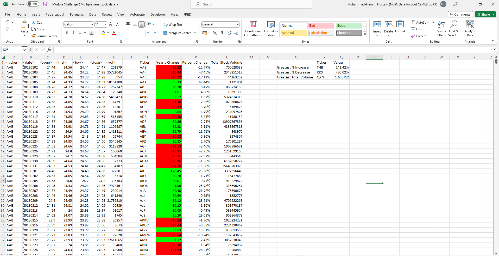

# Exploring Financial Data Analysis through VBA Scripting: Unveiling Stock Market Insights

## Introduction
This project involves delving into dynamically generated stock market data to extract insights. I have crafted a script that computes yearly changes, percentage variations, and cumulative stock volumes, while also identifying stocks with the most substantial percentage fluctuations and trading volumes. As I progressed, I adapted my VBA script for concurrent execution across multiple worksheets, magnifying the impact of automation. The result? Uncovering invaluable financial insights and revolutionising my approach to data manipulation and interpretation.

## Source of Data
Within Resources Folder:
* Multiple_year_stock_data.xlsx

## Findings

### 2018
The table seems to represent a collection of stock data for various tickers (stock symbols) over the course of the year 2018.
The data includes the opening, high, low, and closing prices for each ticker on specific dates, along with the corresponding trading volume.
Yearly changes and percentage changes for each ticker have been calculated, showing how the closing price differs from the opening price at the beginning of the year.The table identifies the stock with the greatest percentage increase, greatest percentage decrease, and greatest total volume among the listed tickers.

1. **Ticker 'DM' experienced a remarkable 5581.16% increase**: This means that the closing price of the stock at the end of the year was significantly higher (approximately 55.81 times higher) than the opening price at the beginning of the year. Such a massive increase suggests that the stock had a highly positive performance during the year, possibly due to factors such as strong financial results, market trends, or positive news.
2. **Ticker 'CBO' faced a significant 95.73% decrease**: This indicates that the closing price of the stock dropped significantly (roughly 95.73%) compared to its opening price at the beginning of the year. A decrease of this magnitude suggests that the stock encountered significant challenges or negative market sentiment throughout the year, which might have been influenced by factors like poor financial performance, industry trends, or unfavorable news.
3. **Ticker 'BAC' had the highest total stock volume, amounting to 21,595,474,700**: The total stock volume refers to the total number of shares traded for a particular stock during the year. A higher total volume often signifies increased investor interest and activity in that stock. In this case, 'BAC' had the highest trading activity among the listed tickers, which could indicate a relatively high level of market liquidity for this stock.

### 2019

### 2020

## Data Dictionary 
1. **Yearly Changes and Percentage Changes**: The data includes columns showcasing the opening and closing prices for various stocks on specific dates. For each stock, the yearly change is calculated as the difference between the opening price at the beginning of the year and the closing price at the end of that year. The percentage change is calculated by comparing these two prices and expressing the change as a percentage of the opening price.
2. **Total Stock Volume**: The data also includes the total stock volume for each stock, which represents the cumulative trading volume over the course of the year. This value indicates the total number of shares traded for a particular stock.
3. **Greatest % Increase and Decrease**: The sheet presents the stocks with the greatest percentage increase and decrease in their prices over the year. These values are important indicators of the most significant shifts in stock values.
4. **Greatest Total Volume**: The stock with the greatest total trading volume throughout the year is identified. This metric helps to understand which stock had the highest overall trading activity.

By analysing this data, we can uncover insights into the performance of various stocks during the years 2018, 2019 and 2020.
